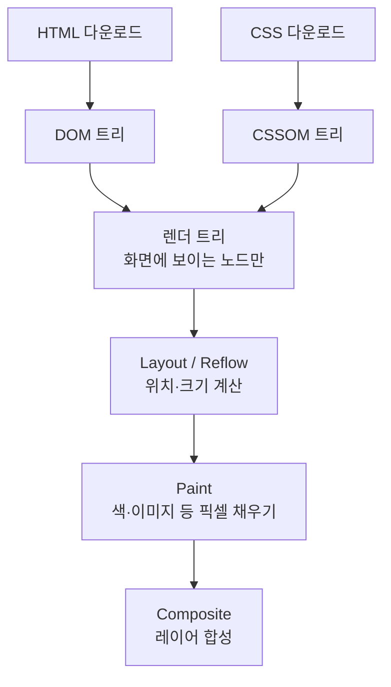
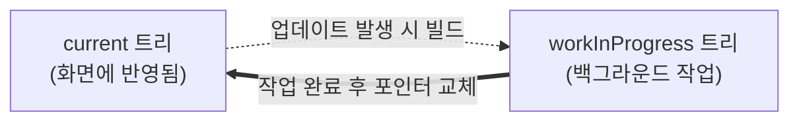

# Core

리액트를 이루는 핵심 요소인 JSX, 가상 DOM, 컴포넌트, 렌더링, 메모이제이션을 정리한다.

---

### JSX

XML과 유사한 내장형 구문으로, 특정 언어에 종속적이지 않은 독자적 문법이다. 자바스크립트 코드 안에 HTML처럼 트리 구조를 가진 요소를 표현한다.

> XML은 데이터를 태그로 감싸 구조화하는 마크업 언어다. HTML과 달리 태그가 미리 정해져 있지 않고 사용자가 직접 정의한다. JSX가 "XML과 유사하다"는 것은 여닫는 태그로 트리를 구성하는 형태만 닮았다는 뜻이다.

#### JSX는 어떻게 자바스크립트로 변환되는가?

JSX를 아무 처리 없이 실행하면 문법 에러가 난다. 자바스크립트 표준 문법이 아니기 때문이다. 바벨 같은 트랜스파일러를 거쳐 자바스크립트 런타임이 이해할 수 있는 코드로 변환된다.

> **트랜스파일러** : 한 언어로 작성한 코드를 다른 언어, 또는 같은 언어의 다른 버전으로 변환하는 도구. C++ 코드를 C로, ES6 문법을 ES5로 바꾸는 것이 예다. 바벨이 JSX와 최신 문법을 구형 자바스크립트로 바꾸는 것도 여기 해당한다.

```jsx
const element = <div>Hello, World!</div>;
```

```js
// 바벨이 JSX를 React.createElement 호출로 변환
const element = React.createElement("div", null, "Hello, World!");
```

JSX는 결국 `React.createElement` 호출로 바뀌는 문법 설탕이다. 브라우저가 JSX를 직접 해석하지 않는다.

#### JSX를 구성하는 요소는 무엇인가?

- **JSXElement** : HTML 요소 같은 기본 단위. 여는 태그 `<div>`, 닫는 태그 `</div>`, 셀프 클로징 ``, 빈 Fragment `<></>` 형태가 있다.
- **JSXAttributes** : 요소에 부여하는 속성. `{}`로 표현식도 넣는다.

```jsx
const element = ;
```

#### 컴포넌트 이름을 대문자로 시작해야 하는 이유는?

사용자가 만든 컴포넌트는 대문자로 시작해야 한다. `createElement`의 첫 인자가 소문자 문자열(`"div"`)이면 HTML 태그로, 대문자로 시작하는 참조(`MyComponent`)면 사용자 컴포넌트로 구분하기 때문이다. 소문자로 만들면 리액트가 존재하지 않는 HTML 태그로 취급한다.

### 가상 DOM과 리액트 파이버

#### 브라우저 렌더링 과정은 어떻게 이루어지는가?

DOM(Document Object Model)은 브라우저가 HTML 문서를 트리 구조의 객체로 표현한 것이다. 이 DOM이 화면에 그려지기까지 과정은 다음과 같다.



1. HTML을 다운로드해 DOM 트리를 만든다.
2. CSS를 다운로드해 CSSOM 트리를 만든다.
3. DOM과 CSSOM을 합쳐 화면에 보이는 노드만 렌더 트리로 구성한다.
4. **Layout(Reflow)** : 각 노드가 화면의 어느 좌표에 얼마만 한 크기로 놓일지 계산한다.
5. **Paint** : 색, 이미지, 그림자 등 실제 픽셀을 채운다.
6. **Composite** : 페인트된 레이어를 합성해 최종 화면을 그린다.

어떤 CSS 속성을 바꾸느냐에 따라 다시 실행되는 단계가 다르다.

| 바꾸는 속성                            | 다시 도는 단계             | 비용            |
| -------------------------------------- | -------------------------- | --------------- |
| `width`, `height`, `top`, `margin`     | Layout → Paint → Composite | 큼 (리플로우)   |
| `color`, `background-color`, `box-shadow` | Paint → Composite       | 중간 (리페인트) |
| `transform`, `opacity`                 | Composite                  | 작음 (GPU 합성) |

`transform`이 `left`보다 빠른 이유가 여기 있다. `left`로 위치를 옮기면 매 프레임 Layout이 다시 일어나지만, `transform`은 별도 레이어로 분리돼 GPU가 합성만 한다. Layout과 Paint를 건너뛰어 애니메이션에 유리하다.

#### 가상 DOM은 왜 등장했는가?

- 웹페이지를 렌더링하는 과정은 복잡하고 비용이 크다.
- 대다수 앱은 렌더링 이후에도 사용자 인터랙션으로 화면을 계속 바꾼다.
- 변경이 일어난 요소가 자식을 많이 가지면 하위 요소까지 덩달아 다시 계산돼 비용이 커진다.
- SPA는 한 페이지에서 모든 작업이 일어나 추가 렌더링이 잦다. 깜빡임 없이 탐색할 수 있는 대신 DOM 관리 비용이 크다.

#### 가상 DOM이란 무엇인가?

실제 브라우저 DOM이 아니라 리액트가 메모리에서 관리하는 가상의 DOM이다. 표시할 DOM을 메모리에 두고, `react-dom`이 실제 반영 준비가 끝났을 때 한 번에 브라우저 DOM에 적용한다.

가상 DOM이 실제 DOM 조작보다 무조건 빠른 것은 아니다. 대부분의 앱을 만들 수 있을 만큼 합리적으로 빠르다고 이해하는 편이 정확하다.

#### 가상 DOM은 어떻게 비교하는가?

상태가 바뀌면 리액트는 새 가상 DOM 트리와 이전 트리를 비교해 바뀐 부분만 실제 DOM에 반영한다. 이 과정을 재조정(Reconciliation), 비교 방식을 디핑(diffing) 알고리즘이라 한다. 트리 두 개를 완전 비교하면 O(n³)이라 비싸서, 리액트는 두 가정을 두고 O(n)으로 줄인다.

- **타입이 다르면 통째로 교체** : `<div>`가 `<span>`으로 바뀌면 하위까지 비교하지 않고 그 트리를 버리고 새로 만든다. 같은 타입이면 속성만 비교해 바뀐 것만 갱신한다.
- **리스트는 `key`로 식별** : 형제 요소를 순서(index)가 아니라 `key`로 매칭해, 중간에 삽입·삭제돼도 나머지를 재사용한다. `key`를 index로 주면 이 최적화가 깨져 엉뚱한 재렌더가 난다.

#### 리액트 파이버란 무엇인가?

가상 DOM과 렌더링 과정을 최적화하는 핵심 구조다.

- **노드 정보** : 컴포넌트 트리의 각 노드가 가진 상태, props, 업데이트, 이펙트 등을 담는다.
- **평범한 JS 객체** : 리액트가 직접 관리하는 자바스크립트 객체다.
- **1:1 대응** : 컴포넌트 하나당 파이버 하나가 대응한다.

파이버는 작업을 비동기로 처리한다.

- 새 업데이트가 오면 렌더링 작업을 중지하고, 재개하고, 다시 시작할 수 있다.
- 이전에 완료한 작업을 재사용하고, 필요 없어진 작업은 버린다.
- 작업을 여러 단위로 나누고 중요도에 따라 우선순위를 매긴다.

파이버는 하나의 작업 단위다. 리액트는 이 단위를 하나씩 처리한 뒤 커밋해 실제 DOM에 반영한다. `react element`는 렌더링마다 새로 생성되지만, 파이버는 가급적 재사용해 객체 생성 비용을 줄인다.

```js
const fiber = {
  type: "div", // 태그 문자열 또는 컴포넌트 함수·클래스
  key: "unique-key",
  stateNode: {}, // 실제 DOM 노드 또는 컴포넌트 인스턴스
  return: parentFiber, // 부모 파이버
  child: childFiber, // 첫 번째 자식
  sibling: siblingFiber, // 다음 형제
  pendingProps: {}, // 새로 들어온 props
  memoizedProps: {}, // 직전 렌더의 props
  memoizedState: {}, // 직전 렌더의 state
  alternate: alternateFiber, // current <-> workInProgress 짝
};
```

부모·자식·형제를 `return` / `child` / `sibling` 포인터로 연결해 트리가 아니라 연결 리스트처럼 순회한다. 이 덕분에 작업을 중간에 멈췄다 이어갈 수 있다.

이 파이버 객체는 리액트 내부 자료구조라 평소엔 숨겨져 있다. 렌더된 DOM 노드에 리액트가 붙여둔 `__reactFiber$...` 프로퍼티로 꺼내 볼 수 있다. 비공식 접근이라 디버깅 용도로만 쓴다.

```js
// Elements 탭에서 요소 선택 후 콘솔에서 실행
const key = Object.keys($0).find((k) => k.startsWith("__reactFiber$"));
console.log($0[key]);
```

#### 렌더 단계와 커밋 단계는 어떻게 나뉘는가?

파이버의 작업은 두 단계로 나뉜다.

- **렌더 단계(Render Phase)** : 사용자에게 보이지 않는 작업을 수행한다. 파이버를 만들고 비교하며(`beginWork`, `completeWork`) 우선순위를 지정하고, 중지·재개·폐기가 일어난다. **비동기**라 중단할 수 있다.
- **커밋 단계(Commit Phase)** : 렌더 단계가 계산한 변경을 실제 DOM에 반영한다(`commitWork`). **동기**로 일어나며 중단할 수 없다.

렌더 단계에서 무엇이 바뀌었는지 다 계산해 두고, 커밋 단계에서 그 결과만 한 번에 DOM에 적용하는 구조다.

#### 파이버 트리는 어떻게 구성되는가?

파이버 트리는 두 개가 존재한다. 화면에 반영된 현재 트리 `current`와, 작업 중인 `workInProgress` 트리다.



- `current`를 기준으로 모든 작업이 시작된다.
- 업데이트가 발생하면 새로 받은 데이터로 `workInProgress` 트리를 빌드한다.
- `workInProgress`가 UI에 최종 반영되면, 리액트는 포인터만 바꿔 이 트리를 `current`로 만든다.

> **더블 버퍼링** : 보이지 않는 곳에서 다음 화면을 미리 그린 뒤, 완성되면 현재 화면과 통째로 교체하는 기법. 중간 상태가 사용자에게 노출되지 않는다. 파이버 트리 교체가 이 방식이다.

`setState`로 업데이트가 발생하면 파이버가 이미 있으므로 새로 만들지 않고, 기존 파이버가 업데이트된 props를 받아 내부에서 처리한다.

#### 리액트의 핵심은 무엇인가?

가상 DOM과 리액트의 핵심은 브라우저 DOM을 더 빠르게 조작하는 것이 아니라, **값으로 UI를 표현**하는 것이다.

```jsx
import { useState } from "react";

const App = () => {
  const [isLoggedIn, setIsLoggedIn] = useState(false);

  return (
    <div>
      {isLoggedIn ? <h1>Welcome back!</h1> : <h1>Please sign up.</h1>}
      <button onClick={() => setIsLoggedIn(!isLoggedIn)}>
        {isLoggedIn ? "Logout" : "Login"}
      </button>
    </div>
  );
};
```

상태 값이 곧 UI를 결정한다. 개발자가 DOM을 직접 조작하지 않고 "이 상태일 때 화면은 이렇다"만 선언하면, 리액트가 상태 변화를 실제 DOM 업데이트로 바꿔 반영한다.

### 클래스 컴포넌트와 함수 컴포넌트

#### 함수 컴포넌트와 클래스 컴포넌트는 무엇이 다른가?

### 렌더링은 어떻게 일어나는가

#### 렌더링과 커밋은 어떻게 구분되는가?

### 메모이제이션

#### memo, useMemo, useCallback은 언제 쓰는가?
